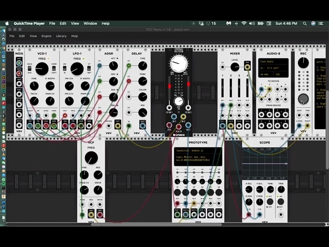

>> gif file:  
>> 
>> 
>> 
>> ------
## Reflection of Last Patch_week01

##Analysis of Sound Segmentation

##Sound Info

* Duration: 1:19.992
* Sample Rate: 44100 Hz
* Channels: Stereo
* Bit Depth: 16-bit
* Format: Waveform Audio 16-bit Integer 

Time  | Description  | Sound Info
------------- | ------------- | -------------
0:00.00 ~ 0:05.30 | fade in | Blank 
0:05.30 ~ 0:14.00 | the first set of mixed highs | aliasing distortion, broad-band noise spectrum of frasonic frequency and infrasonic frequency
0:14.00 ~ 0:16.143 | transient period | Blank
0:16.143 ~ 0:16.192 | brief fade in | low-frequency tone x 4, 0:00:103 per set
0:16.192 ~ 0:29.500 | tone principle 01 | low-frequency tone with schneidend sound of electronics (shattering) 
0:29.500 ~ 0:30.000 | transient period | low-frequency tone
0:30.000 ~ 0:47.000 | tone principle 02 | infrasonic tone with schneidend sound of glitchy electronics (sequential)
0:47.000 ~ 0:49.300 | transient period | low-frequency tone
0:49:300 ~ 0:57.800 | tone principle 03 | low-frequency tone with schneidend sound of electronics (shorten, stable)
0:57.800 ~ 1:00.100 | transient period | low-frequency tone
1:00.100 ~ 1:17.150 | tone principle 04 | low-frequency tone with schneidend sound of electronics (lengthen, shattering)
1:17.150 ~ 1:19.992 | fade out | low-frequency tone
 (lengthen)

