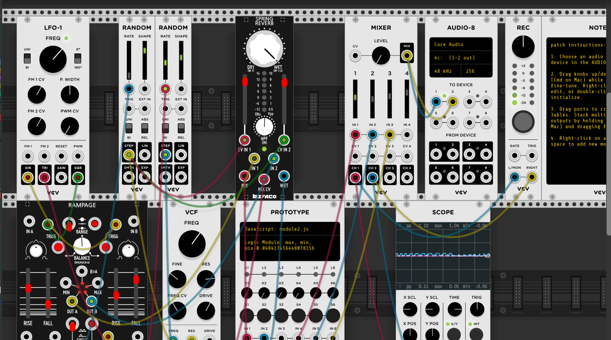
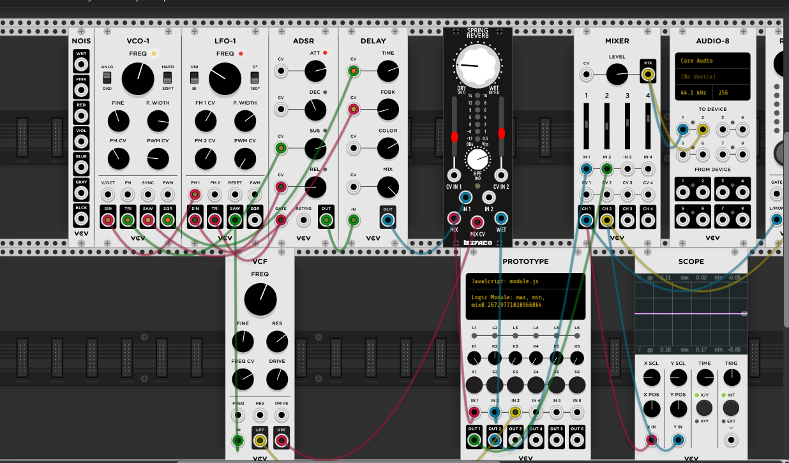
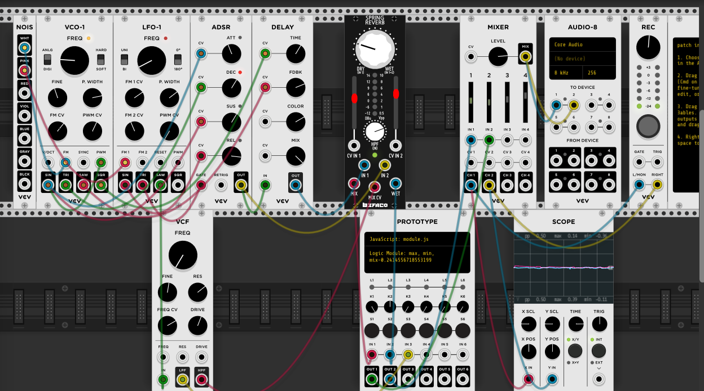

> ### module2 description
> module2.js is logical comparator. It takes signal inputs in Inputs 1 & 2, and outputs the Max, Min, Mix of the two signals out Outputs 1, 2, 3, respectively. 
> 
> - Inputs: IN1, IN2
> - Outputs: OUT1, OUT2, OUT3
> 
> ## Score:
> 
> >Build a rhythmic pattern using the highlighted controls - culminating in noise morphing into tone.
>   

### Listening to the recording

At 00:15 and 00:19 there is a high pith tone that interests me. And I am not sure how it was made. I would like to reproduce that sound following the the score rules. 

At 00:35, there is a change in the score, where the left random rate has been used, creating a dense and suspensful atmosphere

Around 01:00 it starts to increase the volume and density of the piece, to then go back to the previous state.  
 
From 1:10 to 1:30, it slowly increase the rythimic pattern and the frequency amplitude until it  peaks at around 1:35, where the sound becomes more aggressive and fast. It keeps like that for about 15 seconds.  

At 1:50, I can ear a new layer of sound, a higher pitch tone, created by controlling the VCF. Those 2 layers of sound play together until 2:05.  

At 2:05, the noise and lower frequency layer stops abruptly. Random goes back to initial position (0) and the LFO-1 poisiton is in a higher speed that initial.
 
 Now, I can hear just the tone.

> 
> 
> >Lfo-1 freq results in speed changes. 
> > >The left random rate results in “aftershocks” of rhythmic content. 
> > > >VCF freq results in higher overtone-like content  

### Performing the score	  
  While recreating the recording, I took screenshoots and recorded the samples of each change of sound I was recreating in order to compare them. 
  
  > From 2:05 to 2:11- Changes from original 
  
  >* ==LFO-1:Knob turn 1/4 CW==  
  >* ==VCF: knob turn 1/4 CW- marker at 1 pm==
  >* ==Left Random at original position==
    
  
  In the recording.wav committed at saturday 10:35pm my recording is higher than the original and not as choatic. 
  
### Experimenting for my own score

I used the other modules in the patch that weren't assgined in my score, and I tried to stick to 90 seconds. It doesn't have structure, not that it needs to have one, but I am looing for something different. this all is all over the places. 

>> In this commit at 12:41 am, I deleted modules and attach the basics. A VCO, LFO, ADSR, Delay, VCF, Reverb
>> I also added a noise module that I wasn't using this particular time
>> this recording I called it, signal interference
>>    
>> 

After experimenting with my new patch, I decided I wanted a noisy sound that would start very soft and starts building up with time.  
>> In order to make it easier to practice what I have done, I recorded the screen and sound of what I was doing.  
>>  
>>  Here there is a screenshot of the connections I used
>> 
>> >> gif file:  
>> 
>> 

